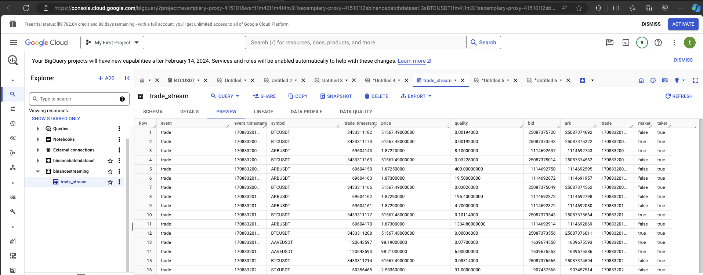

# Building a Mini Data Warehouse with Google Cloud Platform

## Batch Data Pipeline Architecture Diagram.

### Cloud Storage
- This is a message describing the use of a system for managing various files, such as Airflow's Directed Acyclic Graphs (DAGs) and parameter configurations. In this example, DAG files are used to allow Cloud Composer to call the DAGs for deployment in Airflow, and to store configurations for data pipeline construction.
For instance, in the Parameters file, the latest IDs inserted into each table are stored. This is used in subsequent runs to compare with the stored parameter values before creating Parquet files. These Parquet files store only the data IDs that have not yet been inserted into those respective tables.

The Parquets folder will be the section used to store data obtained from calling the API at `/api/v3/historicalTrades` for each symbol.

### Cloud Composer
- This is a service utilized to assist in managing Airflow, which involves receiving the Airflow image and facilitating communication with Cloud Storage.

`Note: Choose a region that Binance supports for its API.`

### BigQuery
- Based on the example, tables will be created separately to store data for each symbol, keeping them distinct from one another.

### Workflow steps

#### In each DAG, there will be two steps together.
- Step 1: `get_data_binance` will make an API call to the endpoint /api/v3/historicalTrades for each symbol and store the retrieved data in Parquet file format. It will also store the parameters of the latest IDs obtained from the data in files for each symbol.
- step 2: `load_parquet_to_bigquery` is the process of loading the stored Parquet files into tables for each symbol in BigQuery.

#### Example data

#### Scheduler : every 5miniuts.

   

## Streaming Data Pipeline Architecture Diagram.

### Websockets
- This is used for enabling full-duplex communication between the application and the Binance server to facilitate real-time data reception.

### Asyncio
- This is used to manage the parallel websockets of symbols ["BTCUSDT", "AAVEUSDT", "STXUSDT", "ARBUSDT"] to enable simultaneous data reception for all symbols.

### Pub/Sub
- This serves as an intermediary for receiving real-time data from the application. From the WebSocket, data will be sent and temporarily stored in a StreamingTopic. Subsequently, DataFlow will handle retrieving the data from the topic for further processing.

### Dataflow
- This is used as a manager to help fetch real-time data from the topic and store the retrieved data into BigQuery for storage.

### Workflow steps
- Step1 : 
When the Websockets receive data from `wss://stream.binance.com:9443/ws` for each symbol, the received data will be sent and stored in the `StreamingBinanceTopic`.
- Step2 : DataFlow will come in to manage fetching the incoming data from `StreamingBinanceTopic` and then proceed to insert the data into the `trade_stream` table.

#### Example Websocket running.

### Example Topic message recieved.

### Example DataFlow Graph

### Example Data inserted.

# End presentation,
#### Best, Regards
#### Thanatthuch Kamseng (Spy) | Candidate
### Thank you.
I'm glad to hear that you're very happy with the test we conducted this time!
